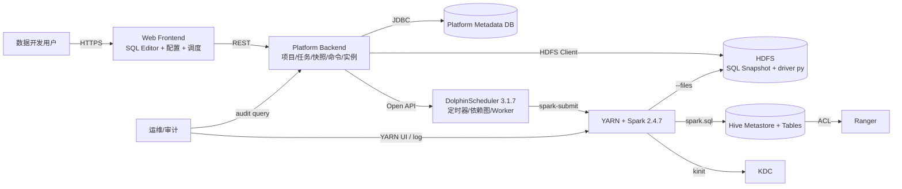
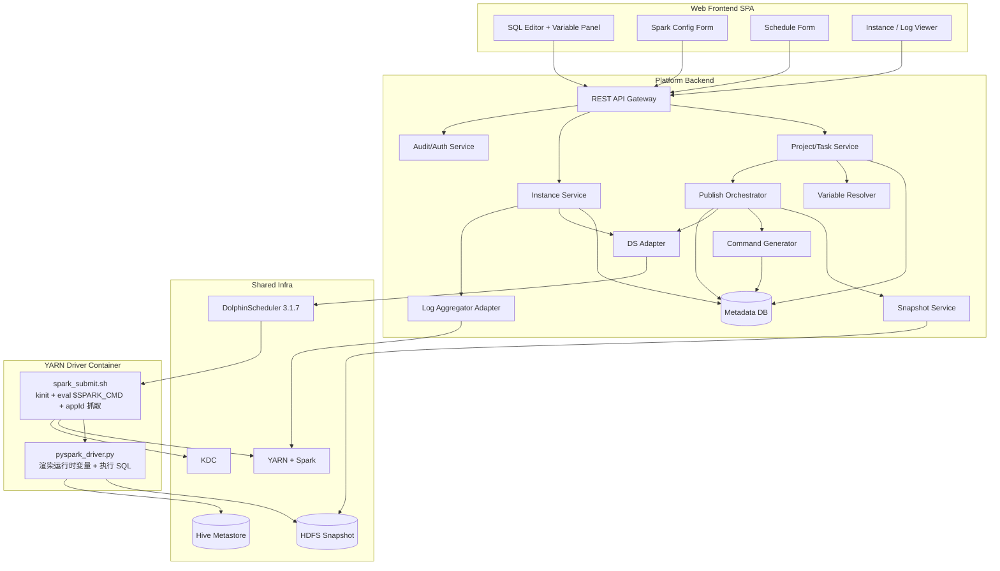
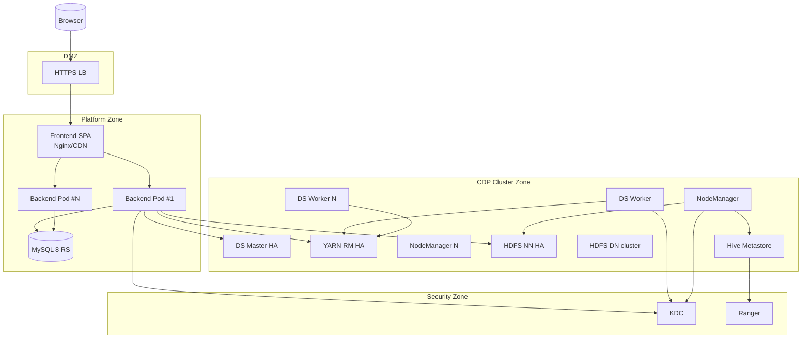

## Scope and Inputs

- **Change boundary**: 新建数据开发中台前端 + 平台后端 + HDFS snapshot 物料层;改造现有 `pyspark_driver.py`;改造 DS shell 模板;DolphinScheduler 3.1.7 仅作为定时器/依赖图;Spark 2.4.7 + CDP 7.1.x 不变。
- **Existing constraints**:
  - CDP 7.1.x、Spark 2.4.7、Python 3、YARN cluster mode、Kerberos(Ranger/Hive ACL 由 CDP 现有体系承担)。
  - DolphinScheduler 已部署 3.1.7,Open API 可用;不替换、不升级。
  - 现存 `pyspark_driver.py`(SQL 拆分、注释处理、UTF-8-sig、`SparkFiles` 多路径回退)整体保留,只做扩展。
  - HDFS、Hive Metastore 既有,本次新增的 snapshot 目录在已有 HDFS 上。
- **Assumptions**(已确认):
  - 后端 Python 3.10+ + FastAPI(模块化单体)。
  - 元数据库 MySQL 8(MVP 起步即用)。
  - 前端 Vue 3 + TypeScript,底座 `vue-element-plus-admin`(`vben-admin` 备选)。
  - HDFS 访问走 WebHDFS REST + SPNEGO Kerberos(不引入 JVM)。
  - 跨层 trace\_id 走 OpenTelemetry W3C traceparent。
  - DS Worker 与平台后端同 IDC,内网互通。
  - 时区统一 `Asia/Shanghai`。
  - 前端走单点 Web 应用(SPA),不走多租户子域。
- **Out of scope**: 实时/流任务、BI/可视化、Spark/DS/CDP 版本升级、Ranger 策略本身的改造。

## Current-State Summary

```
今天的链路(简化):

DS Worker  ──模板替换──▶  spark_submit.sh  ──spark-submit --files──▶  YARN AM (Driver)
                                                                          ▲
                              SQL 文件来自 DS 资源中心                     │
                              (DS 资源中心承担"物料库"职责)               │
                                                                          │
                              所有租户共用 a_xy_mn principal              │
                              所有 conf 在 shell 模板里硬编码  ────────────┘
```

痛点:DS 资源中心只持有"当前版本",所有租户共用 principal,shell 模板拼接命令易注入。

## System Context



### Context Participants

| Participant | Type | Responsibility | Owner | Trust boundary |
|---|---|---|---|---|
| 数据开发用户 | actor | 编写 SQL/配置/发布/查实例 | 业务团队 | 平台外(走平台账号) |
| Web Frontend | system | 编排交互、变量预览 | 平台团队 | 平台内(浏览器仅渲染) |
| Platform Backend | system | 物料/命令/实例/审计 | 平台团队 | 平台内(核心信任域) |
| Platform Metadata DB | datastore | 项目/任务/版本/实例/变量/审计 | 平台团队 | 平台内 |
| HDFS Snapshot | datastore | 不可变 SQL 物料 + driver 物料 | 数据平台 | 共享存储(按租户路径隔离) |
| DolphinScheduler | system | 定时触发、依赖图、Worker 池 | 运维团队 | 共享调度 |
| YARN+Spark | system | 计算 | 数据平台 | 共享计算 |
| Hive Metastore | system | 元数据 | 数据平台 | 共享 |
| KDC / Ranger | system | 认证/授权 | 安全团队 | 信任域分界 |

## Target Component Architecture



### Component Responsibilities

| Component | Responsibility | Inputs | Outputs | State owned | Failure boundary |
|---|---|---|---|---|---|
| SQL Editor + Variable Panel | 编辑 SQL、展示变量、调用预览 | 用户键入 | 草稿 SQL、预览请求 | 草稿(本地+服务端镜像) | 浏览器侧失败可重载 |
| Spark Config Form | 结构化资源/conf 表单 | 用户输入 | 任务配置对象 | 草稿配置 | 表单错误提示 |
| Schedule Form | cron/依赖/补数/SLA | 用户输入 | 调度配置对象 | 草稿调度 | 表单错误提示 |
| Instance / Log Viewer | 实例列表/详情/日志/kill/重试 | 用户操作 | API 调用 | 无 | UI 失败 |
| REST API Gateway | 鉴权、路由、租户上下文注入 | HTTP | 内部 RPC | 无 | 4xx/5xx 透传 |
| Project/Task Service | 项目/任务 CRUD、变量字典 | 内部调用 | metadata 写入 | 项目/任务/变量 | 事务回滚 |
| Variable Resolver | 渲染项目变量 / 校验运行时变量 | SQL 草稿 + 项目变量上下文 | 烤后 SQL / 校验结果 | 无 | 渲染失败拒绝发布 |
| Snapshot Service | 写入 HDFS 不可变 snapshot | 烤后 SQL + 元信息 | snapshot path + version_id | HDFS 物料 + version 表 | 写失败回滚发布 |
| Command Generator | 生成 spark-submit 命令字符串 | 任务配置 + snapshot 路径 + biz_date 占位 | 命令字符串 | 无 | conf 黑名单/转义失败拒发 |
| Publish Orchestrator | 发布事务编排 | 发布请求 | 新 version_id | 发布事务表 | 任一步失败回滚 |
| DS Adapter | upsert workflow/task / kill / 触发 | 内部调用 | DS Open API 调用 | 无 | 重试 + 告警 |
| Instance Service | 实例创建/状态机/重试/补数/kill | 调度回调 / 用户 / 巡检 | metadata 写入 + DS/YARN 控制 | 实例表 | 状态机拒绝非法迁移 |
| Log Aggregator Adapter | 拉取 driver/客户端日志 | application_id | 日志流 | 无 | 失败降级到部分日志 |
| Audit/Auth Service | 用户/租户/权限/审计 | 所有写操作 | 审计记录 | 用户/租户/权限/审计 | 鉴权失败拒绝 |
| Metadata DB | 持久化 | SQL/事务 | 数据 | 全部 metadata | 事务隔离 |
| spark_submit.sh | kinit + eval + appId 回写 + kill 透传 | DS 注入的环境变量 | spark-submit 调用 | 无 | 退出码透传 DS |
| pyspark_driver.py | 读 snapshot、渲染运行时变量、按序执行 SQL | snapshot + biz_date + trace_id | spark.sql | 无 | 异常上抛终止 application |

## Interfaces and Dependencies

| From | To | Interface/protocol | Sync/async | Contract/version | Timeout/SLA | Compatibility |
|---|---|---|---|---|---|---|
| Frontend | API Gateway | REST/JSON over HTTPS | sync | OpenAPI v1 | 30s | 前后端版本独立部署,API 向后兼容 |
| API Gateway | Backend services | 进程内调用(同 Python 进程) | sync | 内部接口 | — | 模块化单体,内部强一致 |
| Backend | Metadata DB | SQLAlchemy + PyMySQL | sync | MySQL 8 | 1s | DDL 走 Alembic 迁移 |
| Backend | HDFS | WebHDFS REST + SPNEGO Kerberos | sync | HDFS 3.x(CDP 7.1) | 10s | snapshot 路径 schema 含 version |
| Backend | DolphinScheduler | Open API HTTPS | sync | DS 3.1.7 Open API | 5s + 重试 | httpx client,跟随 DS 升级时需回归 |
| Backend | YARN(查 application 状态) | YARN REST API | sync | YARN 3.x | 5s | 仅读 |
| Backend | KDC(签发 ticket 给后端自身) | Kerberos | sync | MIT KRB5 | 内部 | — |
| spark_submit.sh | KDC | kinit | sync | — | 30s | — |
| spark_submit.sh | spark-submit | 进程 exec | sync | Spark 2.4.7 | task SLA | — |
| Driver | HDFS(snapshot) | --files localized | sync | hdfs:// path | — | Spark 2.4 cluster 模式已支持 |
| Driver | Hive | spark.sql | sync | Hive 2.x via CDP | — | enableHiveSupport + convertMetastoreParquet=false |
| Backend | Log Aggregator | YARN REST + HDFS log dir | sync/poll | — | 5s | 终态后从聚合日志读 |

## Deployment Topology



| Runtime unit | Environment/node | Scaling model | Configuration/secrets | Health/readiness | Owner |
|---|---|---|---|---|---|
| Frontend SPA | Nginx/CDN | 静态资源,水平 | 仅 API base url | HTTP 200 | 平台前端 |
| Backend Pod | K8s, Python 3.10+ uvicorn,~1GB | 水平多副本无状态 | 配置中心 + Vault 拿 KDC keytab(后端自身) | `/health` + 数据库探针 | 平台后端 |
| MySQL 8 | MVP 单实例,后期主从 | 垂直为主,扩展时升主从 | DBA 管 | mysqld\_exporter | DBA |
| DS Master/Worker | CDP 节点 | DS 自带 HA | 平台 keytab + Worker 标签 | DS 自带健康 | 数据平台 |
| YARN RM/NM | CDP 节点 | CDP 标准 | CDP 配置 | CDP 监控 | 数据平台 |
| HDFS NN/DN | CDP 节点 | CDP 标准 | CDP 配置 | CDP 监控 | 数据平台 |
| KDC | 安全团队 | 主从 | — | 安全监控 | 安全团队 |

## Security and Trust Boundaries

- **Authentication**: 用户 → Frontend(平台 SSO/OIDC) → Backend(JWT/Session);Backend ↔ HDFS/YARN/Hive(Kerberos,后端自身一对 principal/keytab);任务执行 ↔ HDFS/YARN/Hive(按租户路由 principal)。
- **Authorization**: 平台层维护"用户-租户-项目-资源"权限矩阵;落地到 YARN queue 与 Ranger 表权限;每次发布/触发时刻校验。
- **Secrets**:
  - 后端自身 keytab → Vault/K8s secret,只挂载到 Backend Pod。
  - 租户 keytab → 仅 DS Worker 可读路径,文件权限 0400,DS shell 模板 `set +x` 包裹。
  - DB 密码、DS Open API token → 配置中心,加密落地。
- **Network boundaries**: Browser → Platform Zone(HTTPS only);Platform Zone → CDP Zone(IDC 内网,Kerberos)。Platform Zone 不暴露 HDFS/YARN/Hive 直连给浏览器。
- **Sensitive operations**:
  - 命令生成的 conf 黑名单(见 [[command-generation]])。
  - shell 严格转义。
  - kill 同时作用于 DS task + YARN application。
- **Audit**: 实例记录写入 `(submitter, tenant, principal, queue, version_id, biz_date, application_id, trace_id)`;命令字符串归档(脱敏 keytab 路径外的字段);权限变更记录到审计表,只追加。

## Capability-to-Component Mapping

| Capability | Entry component | Owning component | Supporting components |
|---|---|---|---|
| sql-editor | Frontend Editor | Project/Task Service | Variable Resolver(预览渲染) |
| spark-config | Frontend Config Form | Project/Task Service | Command Generator(白名单校验) |
| schedule-management | Frontend Schedule Form | Project/Task Service | DS Adapter / Instance Service |
| sql-snapshot | Publish Orchestrator | Snapshot Service | HDFS / Variable Resolver |
| command-generation | Publish Orchestrator + Instance Service | Command Generator | Audit/Auth |
| runtime-variable-rendering | pyspark_driver | pyspark_driver | — |
| dolphinscheduler-integration | Publish Orchestrator + Instance Service | DS Adapter | DS Open API |
| task-instance-lifecycle | Instance Service | Instance Service | DS Adapter / Log Aggregator |
| multi-tenant-isolation | API Gateway + Audit/Auth | Audit/Auth Service | Command Generator(principal 路由) |
| observability | Instance Service | Log Aggregator Adapter | pyspark_driver(结构化日志)/ spark_submit.sh(appId 抓取) |
| publish-pipeline | Publish Orchestrator | Publish Orchestrator | Snapshot / Command Generator / DS Adapter / Metadata DB |
| pyspark-driver(modified) | Driver 容器入口 | pyspark_driver.py | spark_submit.sh |

## Architectural Constraints and Invariants

1. **DS 不持有用户物料**:DS 资源中心仅留 keytab 等基础设施级文件,用户 SQL 与 driver py 都来自 HDFS snapshot。
2. **命令字符串只读路径**:任何 conf 都不在 DS Worker 上拼接;DS shell body 只 `eval "$SPARK_CMD"`。
3. **snapshot 一旦写入永不修改**:回滚靠"重新指针",不靠"覆盖"。
4. **实例三元组 `(task_id, version_id, biz_date)` 在创建时刻锁定**:重试不重新选版本。
5. **driver 永远向后兼容**:driver 升级不需要重写历史 snapshot。
6. **principal 不跨租户**:命令生成阶段保证 1:1 路由。
7. **跨层 trace_id 贯穿**:Frontend → Backend → DS task body → driver 日志 → Log Aggregator。
8. **Backend 是单一信任域**:Frontend 不直接访问 HDFS/YARN/Hive。

## Alternatives and Open Decisions

| 决策 | 选项 | 决议 | 锚定 / 状态 |
|---|---|---|---|
| 后端语言 | Java/Spring Boot vs Go vs Python(FastAPI) | Python 3.10+ + FastAPI | Decision 5 / Accepted |
| Backend 单体 vs 微服务 | 单体 / 模块化单体 / 微服务 | 模块化单体 | Decision 5 / Accepted |
| 元数据库 | MySQL 8 / PostgreSQL / SQLite(过渡) | MySQL 8(MVP 起步即用) | Decision 5 / Accepted |
| HDFS 访问方式 | WebHDFS REST / libhdfs JNI / `hdfs dfs` CLI | WebHDFS REST + SPNEGO Kerberos | Decision 5 / Accepted |
| snapshot 物料层 | HDFS / 对象存储 | HDFS | Decision 5 / Accepted |
| 命令字符串注入方式 | 环境变量 `SPARK_CMD` / 文件挂载 | 环境变量(关注 DS 自定义参数 ~32KB 上限) | Decision 3 / Accepted |
| Frontend 框架 | React / Vue 2 / Vue 3 | Vue 3 + TypeScript,底座 `vue-element-plus-admin`(`vben-admin` 备选) | Decision 11 / Accepted |
| trace\_id 协议 | OpenTelemetry W3C / 自定义 UUID | OpenTelemetry W3C traceparent | Decision 7 / Accepted |
| Backend ↔ DS 是否引入 MQ | 同步 httpx / 异步 MQ | MVP 同步 httpx,后期评估 | Accepted |
| driver 时区注入 | 命令行参数 / 环境变量 / 配置文件 | 命令行参数 `--timezone` | Decision 6 / Accepted |
| 高级 conf 黑名单粒度 | key 级 / value 级正则 | key 级 | Decision 9 / Accepted |
| 灰度开关粒度 | 租户/项目/任务 | 项目级 | Decision 8 / Accepted |
