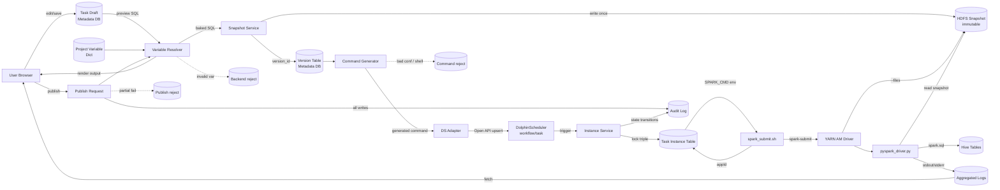

## Scope and Data Inventory

本 change 涉及 4 类数据对象,均围绕"任务的可重放、可审计"展开。

| Data object | Producer | Consumers | Classification | Source of truth | Retention |
|---|---|---|---|---|---|
| 任务草稿(SQL 文本 + 配置) | 用户(Frontend Editor) | Backend(Project/Task)、Variable Resolver(预览) | 业务代码 | Metadata DB(`task_draft` 表) | 长期(版本无关) |
| 项目变量字典 | 项目管理员 | Variable Resolver、SQL Editor 变量面板 | 配置 | Metadata DB(`project_variable`) | 长期,变更追溯 |
| SQL Snapshot(已烤入项目变量的 SQL 物料) | Snapshot Service(发布时写) | YARN Driver(`--files`)、用户(查看实例所跑 SQL) | 不可变物料 | HDFS(`snapshots/<env>/<task>/<version>/x.sql`) | 永久(随任务存,删除任务前不删) |
| 命令字符串(spark-submit 命令) | Command Generator | DS task body(via `SPARK_CMD` 环境变量)、审计 | 衍生数据(可重放) | Metadata DB(`task_instance.command_text`) | 与实例同生命周期 |
| 任务实例(三元组+状态机) | Instance Service(创建/触发) | DS Adapter、Frontend、审计 | 业务事实 | Metadata DB(`task_instance`) | 1-3 年(按合规) |
| Driver 结构化日志 | pyspark_driver | Log Aggregator → Frontend | 运维数据 | YARN aggregated logs(HDFS) | 30-90 天(YARN 配置) |
| 审计记录 | Audit Service | 合规/运维 | 合规 | Metadata DB(`audit_log`) | 按合规要求(通常 ≥1 年) |
| 租户 keytab | 安全团队 | DS Worker | 机密 | DS Worker 文件系统(0400) | 与 principal 同生命周期 |

## End-to-End Data Flow

### Flow Steps

| # | From → To | Data/contract | Transformation | Validation | Persistence | Failure destination |
|---|---|---|---|---|---|---|
| 1 | User → Task Draft | `{sql_text, spark_conf, schedule_conf}` | — | 字段非空、SQL 非空 | `task_draft` 表 | 表单错误返回 user |
| 2 | Draft → Variable Resolver(预览) | `{sql_text, biz_date, project_vars, runtime_vars_catalog}` | 渲染所有变量 → 完整 SQL | 未定义变量 → fail | 不持久化(只读) | reject 给 Frontend |
| 3 | User → Publish Request | `{task_id, draft_revision_id, idempotency_key}` | — | 鉴权、queue 权限、conf 白名单 | 事务记录 `publish_event` | reject + 不前进 version |
| 4 | Publish → Variable Resolver(发布渲染) | 同 #2,但 runtime vars 保持占位 | 仅烤入项目变量 | 同 #2 | 内存中间产物 | 事务回滚 |
| 5 | Resolver → Snapshot Service | baked SQL bytes + meta | — | 大小 ≤ 阈值、UTF-8 | HDFS 写一次 + `version` 表 | 事务回滚 + 不暴露 path |
| 6 | Version Table → Command Generator | `{snapshot_path, spark_conf, queue, principal, app_name}` | 拼 spark-submit 命令字符串 | conf 白/黑名单、shell 转义 | `task_instance.command_template`(模板) | reject + 不前进 |
| 7 | Command + DS Adapter → DolphinScheduler | DS Open API: workflow/task body 模板 | 把 `SPARK_CMD` 模板挂到 DS | 幂等键 | DS metadata + 平台 `ds_sync` 表 | 重试 1 次 + 告警,失败回滚发布 |
| 8 | DS → Instance Service(触发) | `(task_id, biz_date)` | 锁定 `version_id` + 渲染 `--biz-date` 实参 | 状态机校验 | `task_instance` 表(状态 `submitting`) | 实例 `submit_failed` |
| 9 | Instance → DS task body env `SPARK_CMD` | 命令字符串 | 替换占位 `${biz_date}` 为实参 | shell 转义复检 | 写 `task_instance.command_text`(脱敏) | 同上 |
| 10 | spark_submit.sh → YARN | spark-submit syscall | kinit + eval | spark-submit 退出码 | 实例 `application_id` 字段(从 stdout 抓取) | `submit_failed` |
| 11 | Driver → HDFS | `--files` localized SQL | — | 文件存在 | — | 直接 application 失败 |
| 12 | Driver → Hive | spark.sql(stmt) × N | SQL 执行 | spark.sql 异常上抛 | Hive 表数据 | application failed,日志写聚合 |
| 13 | Driver → Aggregated Log | structured log lines | — | — | YARN aggregated logs(HDFS) | YARN 自带容错 |
| 14 | All writes → Audit | append-only | — | trace_id、actor 必填 | `audit_log` 表(append-only) | 写入失败阻塞主流程(由审计要求决定) |

## Data Contracts

### Task Draft

| Field | Type | Required | Meaning | Constraints | Sensitive | Compatibility |
|---|---|---|---|---|---|---|
| task_id | string(uuid) | yes | 任务标识 | 平台生成 | no | immutable |
| draft_revision_id | string(uuid) | yes | 草稿版本(每次自动保存) | 单调 | no | append-only |
| sql_text | text | yes | 用户原始 SQL(含占位符) | UTF-8、≤ N MB | 业务敏感 | 仅在租户内可见 |
| spark_conf | json | yes | 结构化配置 + 高级 conf 数组 | 后端二次校验 | no | 字段可加,语义不可改 |
| schedule_conf | json | yes | cron + 依赖 + SLA | 校验合法性 | no | 字段可加 |
| updated_at | timestamp | yes | 最后保存时间 | — | no | — |

- Primary key: `task_id`
- Idempotency: `draft_revision_id`(防止两端同步抖动)

### Project Variable Dict

| Field | Type | Required | Meaning | Constraints | Sensitive |
|---|---|---|---|---|---|
| project_id | string | yes | 所属项目 | — | no |
| name | string | yes | 变量名(不含 `$`) | `[A-Za-z_][A-Za-z0-9_.]*` | no |
| value | string | yes | 当前值 | 不允许多行 | 敏感时按 vault 引用 |
| version | int | yes | 变量值版本(变更追溯) | 单调 | no |
| effective_at | timestamp | yes | 生效时间 | — | no |

发布时取 `effective_at <= publish_time` 的最新值,与 task version 一并固化。

### SQL Snapshot

- **存储路径协议**: `hdfs:///dwh/platform/snapshots/{env}/{task_id}/{version_id}/sql.sql`
- **元信息(同目录)**: `meta.json` 含 `{task_id, version_id, env, draft_revision_id, baked_at, project_var_versions: {...}, sha256}`
- **不可变性**: HDFS 上写权限只赋 Snapshot Service,且每次发布写到全新 version_id 路径
- **去重键**: 不去重(同内容多次发布生成多个 version_id,语义上是不同发布事件)
- **校验和**: 写入后回读 `sha256` 比对,不一致则事务回滚

### Task Instance

| Field | Type | Required | Meaning | Sensitive |
|---|---|---|---|---|
| instance_id | string(uuid) | yes | 实例 ID | no |
| task_id | string | yes | 任务 ID | no |
| version_id | string | yes | 锁定的 SQL 版本 | no |
| biz_date | string(yyyyMMdd) | yes | 业务日期 | no |
| trigger_source | enum | yes | `schedule` / `backfill` / `manual` | no |
| state | enum | yes | 状态机字段 | no |
| submitter | string | yes | 平台用户 | 审计字段 |
| tenant_id | string | yes | 租户 | no |
| principal | string | yes | 实际提交身份 | no |
| queue | string | yes | YARN 队列 | no |
| application_id | string | optional | YARN appId | no |
| trace_id | string | yes | 跨层追踪 | no |
| command_text | text | yes | 命令字符串(脱敏) | keytab 路径外字段 |
| created_at, started_at, ended_at | timestamp | mixed | 状态时间戳 | no |
| retry_count | int | yes | 重试次数 | no |

- Primary key: `instance_id`
- Lock-triple: `(task_id, version_id, biz_date, trigger_source, retry_count)` 全局唯一约束(防止重复创建同 retry)
- Idempotency for kill: `kill_request_id` 字段

### Spark Command String

- **格式**: 单行(逻辑上),由 Command Generator 生成
- **模板字段**(发布期生成):`{master, deploy-mode, queue, principal, keytab, name, conf*, files, driver, --sql-file, --timezone, --trace-id, --version-id}`
- **运行期填充**:`--biz-date <yyyyMMdd>` 由 Instance Service 在触发时填入
- **不可变性**:模板与每次实际填充的命令都归档到 `task_instance.command_text`
- **脱敏规则**:keytab 文件内容不进日志;keytab 路径以白名单形式可见

## Storage / Cache / Queue / File / External

| Layer | Purpose | Tech | Volume estimate | Latency target | Consistency |
|---|---|---|---|---|---|
| Metadata DB | 平台所有元数据 | MySQL 8(主从) | 任务 1-10 万,实例 千万级 | < 50ms 读 | 单源强一致 |
| HDFS Snapshot | 不可变 SQL 物料 | HDFS 3.x(CDP) | 每发布 < 100KB,累计 GB 级 | 读 < 1s | 写一次,读多次 |
| YARN Aggregated Log | driver 日志 | HDFS | 每实例 MB 级 | 终态后 < 30s 聚合 | 最终一致 |
| DS Metadata | DS 自有 | DS 配 MySQL | 与平台 task 同量级 | 与 DS 一致 | 跟随 DS |
| Audit Log | append-only 审计 | 可与 Metadata DB 同库,独立表 | 写多读少 | 强一致,只追加 | — |
| Cache(可选) | 项目变量字典、queue 权限 | Redis 或进程内 | 小 | < 10ms | TTL 失效,以 DB 为准 |

## Sensitive-Data Boundaries

| Data | Sensitivity | Boundary | Encryption |
|---|---|---|---|
| 用户 SQL | 业务敏感 | Frontend↔Backend HTTPS;HDFS 路径按租户;Metadata DB 行级权限 | TLS in-flight;HDFS 透明加密(若 CDP 启用) |
| 项目变量 value | 可能含连接串/路径 | 与 SQL 同隔离;敏感值通过 vault 引用,DB 中只存引用 | 同上 |
| keytab 文件 | 机密 | 仅 DS Worker 可读,文件 0400;backend 自身 keytab 在 K8s secret/Vault | 静态加密 |
| Spark Command 字符串 | 含 principal/keytab 路径 | DB 中归档;前端展示需脱敏(隐藏 keytab 路径) | 同上 |
| Driver 日志 | 含 SQL 渲染后内容 | YARN 聚合日志 ACL;Frontend 展示需租户校验 | HDFS 加密 |
| 审计日志 | 合规 | 仅审计角色可读,append-only,定期归档冷存 | 同上 |

## Validation, Idempotency, Quality

- **Variable Resolver**:发布前确保所有 `${...}` 占位符要么是项目变量(此时被替换)、要么是 driver 承诺的运行时变量名(此时保留),否则发布失败。
- **Command Generator**:conf key 白名单 + 黑名单严格;所有可注入字段单引号包裹并转义;命令字符串生成后做"二次解析自检"(用 shlex 等等价器解析回 token 列表,确认 token 数与设计一致)。
- **Snapshot 写一次**:`open(O_CREAT|O_EXCL)` 语义;路径含 `version_id`(单调,不重用);写完回读 sha256 校验。
- **Publish 幂等**:`(task_id, draft_revision_id, idempotency_key)` 唯一约束;重复请求返回首次的结果。
- **Instance 创建幂等**:DS 触发可能重发,(`task_id, biz_date, trigger_source, scheduled_at`) 唯一,重复触发不重复创建。
- **State machine guards**:状态迁移由数据库 CAS 写(WHERE old_state = ...)实现,任何并发更新必须落在合法迁移上。
- **Driver 渲染严格**:默认 `--allow-unresolved-vars=false`,除非 SQL 中故意保留(罕见)。
- **kill 幂等**:`kill_request_id` 全局唯一,重复 kill 返回首次结果。

## Failure / Replay / Recovery

| Scenario | Detection | Behavior |
|---|---|---|
| Snapshot 写 HDFS 失败 | 写后回读校验失败 | 标记 publish 失败,sha256 不匹配的 path 加 `.failed` 后缀(不删,留证据);事务回滚 |
| DS upsert 失败 | Open API 4xx/5xx | 重试 1 次;仍失败回滚 publish(已写入的 snapshot 保留但不被引用) |
| Backend 与 DS metadata 不一致 | 后台巡检 diff | 告警 + 人工介入;不静默修复 |
| spark-submit 提交失败 | 客户端非 0 退出且无 appId | 实例 `submit_failed`,可重试 |
| Driver 异常 | application failed | 实例 `failed`,日志可见;按重试策略再创建子重试(三元组不变,retry_count++) |
| kill 半途失败 | DS 已 kill 但 YARN 未 | 监控 application 状态轮询,直到 YARN 也终止 |
| Aggregated log 拉不到 | YARN 接口失败 | 前端降级展示客户端日志 + 错误提示 |
| 时间变量回归 | 单元/集成测试 | driver 与 frontend 共用变量字典 fixture |

回放路径:任意 `task_instance.command_text` + 同 `version_id` 的 snapshot,可在测试环境完整重放(脱敏字段在测试集群替换)。

## Volume / Latency / Freshness

| 指标 | 目标 |
|---|---|
| 同时在跑实例数 | 数百级(按现有 YARN 容量) |
| 单租户每日新增实例 | 千级 |
| 发布事务端到端延迟 | < 5s(网络稳定时) |
| 实例触发到 spark-submit 启动 | < 30s |
| 前端"看日志"实时延迟 | 运行中 < 10s,终态后 < 30s |
| Metadata DB 读 P99 | < 100ms |
| Snapshot HDFS 写入 P99 | < 2s |
| 跨层 trace_id 覆盖率 | 100% 实例 |

## Lineage

- **Task lineage**:每个 `task_instance` 关联 `version_id` → `snapshot meta.json` → `draft_revision_id` → `task_id` → `project_id`,可前后追溯到具体作者与变量取值。
- **Data lineage**:driver 日志含 SQL 哈希与 statement 序号,与 snapshot 的 sha256 对齐,可在数据治理系统(若有)挂接表级 lineage。
- **Audit lineage**:任意写操作记录 `actor + tenant + trace_id + before/after`,满足合规追溯。

## Out-of-scope Data Concerns

- 表级数据 lineage 自动抓取(由数据治理平台承担)。
- SQL 自动数据质量校验(SLA 之外的内容质量,如行数突变)。
- 数据冷热分层、HDFS 容量管理(运维既有体系)。
