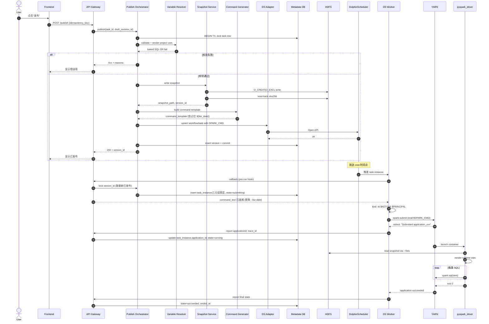
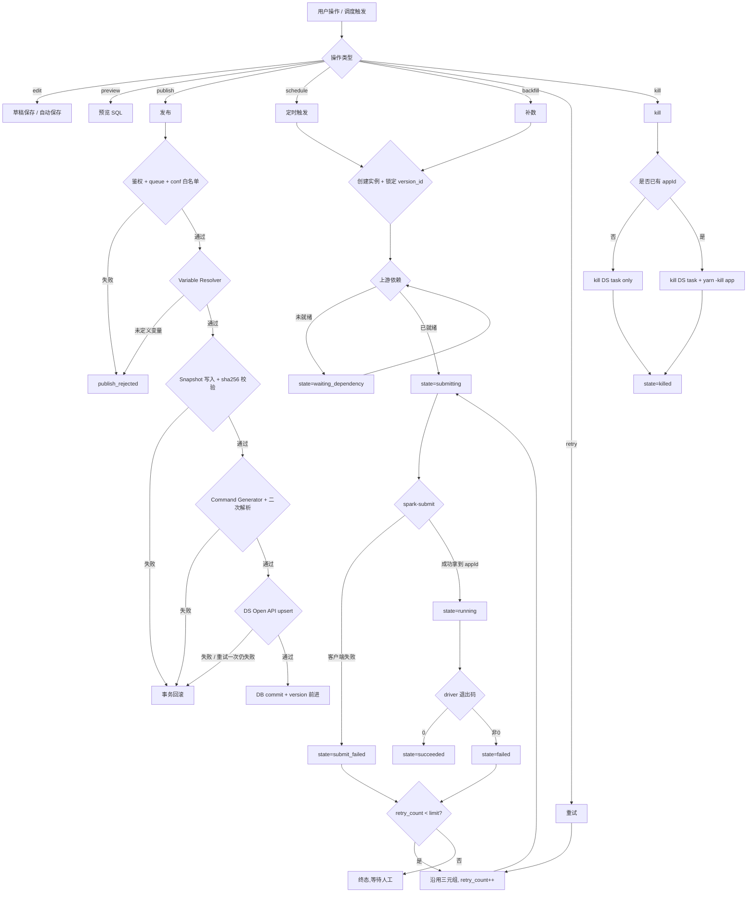
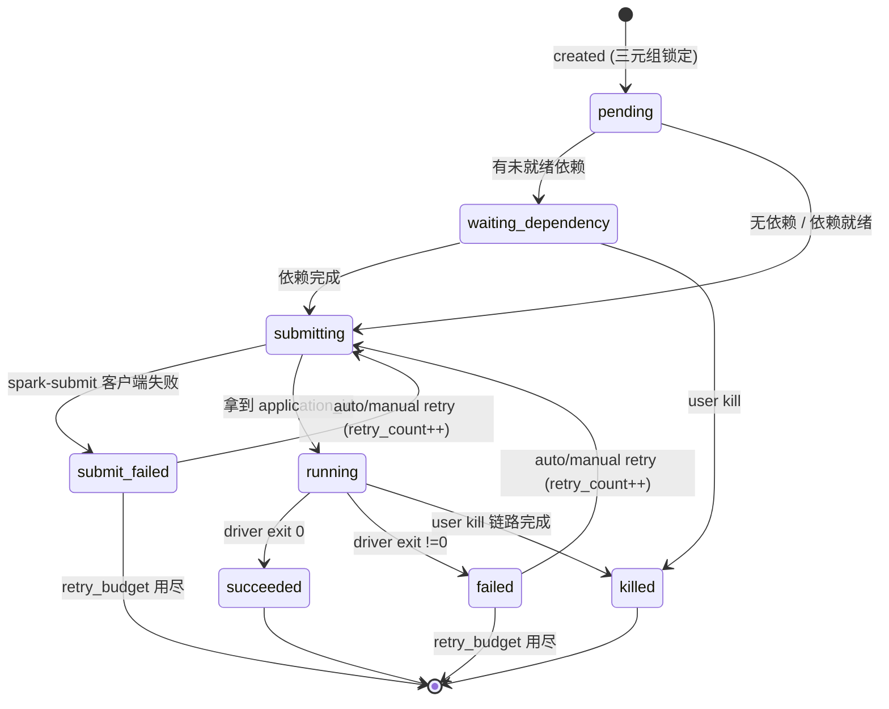
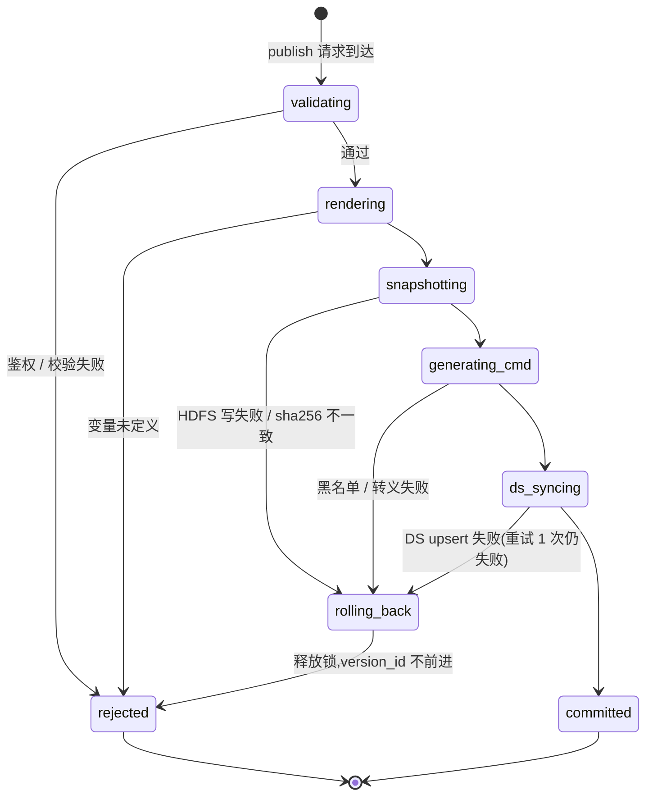

## Runtime Scope

- **Actors/triggers**:
  - 数据开发用户(编辑、保存、预览、发布、补数、kill、查日志)
  - DolphinScheduler(按 cron 定时触发)
  - 平台后台巡检(DS↔Backend metadata 一致性、长跑实例超时)
  - 自动重试(配额内)
- **Entry points**:
  - Frontend → Backend REST(用户操作)
  - DS Worker shell task(调度触发)
  - 平台定时 Job(巡检/补数批处理)
- **Preconditions**:
  - 用户已通过平台 SSO,Frontend 持有有效 token
  - Backend 自身 Kerberos ticket 有效(可访问 HDFS/YARN)
  - DS Open API 可达
  - DS Worker 节点 keytab 文件存在且权限 0400
- **Runtime invariants**:
  - 实例三元组在创建时锁定,生命周期不变
  - snapshot 写入后只读
  - 状态机迁移由 DB CAS 保证
  - 命令字符串生成失败 ⇒ 不下发
  - kill 必须使 DS task + YARN application 同步终止
- **Excluded flows**:草稿自动保存、纯只读浏览(无控制分支,略);Spark 内部容错(由 Spark 自身负责)。

## Primary Interaction Sequence — 发布与首次触发

## Branching / Decision Logic

## State Machine — Task Instance

合法迁移以 DB CAS 实施(`UPDATE ... WHERE state = <expected>`),非法尝试返回 0 行受影响,记录告警。

## State Machine — Publish Transaction

`rolling_back` 状态下,已写入的 snapshot path 不删除(保留证据),但不进入 `version` 表,因此调度永不引用。

## Concurrency / Idempotency / Backpressure

| 维度 | 策略 |
|---|---|
| 用户重复点击发布 | `idempotency_key`(由 Frontend 生成 UUID) + `(task_id, draft_revision_id)` 唯一约束 |
| DS 重复触发(网络抖动) | `(task_id, biz_date, trigger_source, scheduled_at)` 唯一,重复触发返回首次实例 |
| 平行补数 | 用户可选"串行"(同时只一个 instance run)或"并行"(按 biz_date 全部下发,YARN 自身限流) |
| 同任务同 biz_date 的多次触发 | 由唯一约束阻止;补数复算需先 kill 旧实例或显式覆盖 |
| Backend 多副本 | 单一 DB,行级锁 + CAS;无单副本依赖 |
| DS Adapter 限流 | 每秒 N 次 DS Open API 调用 token bucket;超限 backpressure 到 Publish Orchestrator |
| YARN backpressure | 由 YARN queue 容量决定,平台不主动限流 |
| 重试预算 | 每实例 retry_count 上限可配(默认 2),用尽进终态 |
| 巡检任务 | 加分布式锁(DB advisory lock 或 Redis SETNX),保证单实例运行 |
| Driver 内并行 | driver 串行执行 SQL;Spark 内的并行由 executor 决定 |

## Failure / Recovery

| Failure | Detection | Action | Retry budget | Compensation |
|---|---|---|---|---|
| Frontend → Backend 网络抖动 | HTTP 5xx/超时 | 自动重试 + idempotency_key | 客户端重试 ≤ 3 | 服务端幂等 |
| Project Variable Dict 缺失 | Resolver 抛 UndefinedVariable | publish 拒绝 | 0 | 提示用户补字典 |
| Snapshot 写半途失败 | 回读校验失败 | 标记 path `.failed` | 0 | 事务回滚 |
| DS Open API 不可达 | 网络/4xx/5xx | DS Adapter 重试 1 次(指数退避) | 1 | 仍失败 → 发布回滚 |
| DS↔Backend metadata 漂移 | 巡检 diff | 告警 + 运维介入 | — | 不静默修复 |
| spark-submit 提交失败 | shell 非 0 退出 | 进入 submit_failed | 按任务配置 | 可手动复发 |
| application 跑挂 | YARN final state != SUCCEEDED | 进入 failed | 按任务配置 | 重试沿用三元组 |
| application 长跑超 SLA | 巡检比对 started_at | 告警(不自动 kill) | — | 用户决定 kill |
| kill 调用一半失败 | DS killed 但 YARN running | 巡检轮询 application 状态,继续 `yarn -kill` | 直至成功 | 监控暴露 |
| Driver 渲染未定义变量 | driver fail-fast | 进入 failed | — | 提示用户检查变量字典 |
| HDFS 全局不可用 | publish 全部失败 | 立即告警 | — | 等待恢复 |
| Backend 自身 Kerberos 过期 | 周期 kinit 失败告警 | 重新 kinit | — | 服务降级:只读 |

## Non-functional Runtime Targets

| 指标 | 目标 |
|---|---|
| 发布 P95 端到端延迟 | < 5s(snapshot 小、网络稳定) |
| 触发到 spark-submit 启动 | < 30s |
| 前端实时日志延迟 | 运行中 < 10s |
| DS Adapter 调用成功率 | > 99.5% |
| State machine 非法迁移率 | 0(任何非 0 视为 bug) |
| trace_id 覆盖率 | 100% |
| 重试自然成功率 | > 30%(衡量自动重试有效性) |

## 分支 → Spec Scenario 映射

| Branch / terminal state | Spec scenario |
|---|---|
| publish_rejected(鉴权/queue) | spark-config: 队列提交权限校验 / 用户选择无权限的队列 |
| publish_rejected(变量未定义) | sql-editor: 用户在 SQL 中使用未声明的变量 |
| publish_rejected(conf 黑名单) | command-generation: 黑名单 key 拒绝合入 |
| publish_rejected(shell 注入) | command-generation: shell 严格转义 / conf 值含特殊字符 |
| publish 成功 | publish-pipeline: 全链路成功 / sql-snapshot: 用户发布任务 |
| publish 任一步失败 | publish-pipeline: 任一环节失败 |
| 重复 publish | publish-pipeline: 客户端重试 |
| 实例 waiting_dependency | schedule-management: 上游缺失或失败时的下游行为 |
| 实例 submit_failed | task-instance-lifecycle: 正常生命周期(反向) / dolphinscheduler-integration: 提交失败 |
| 实例 running → succeeded | task-instance-lifecycle: 正常生命周期 |
| 实例 running → failed → 重试 | task-instance-lifecycle: 重试不重新选版本 |
| 实例 kill 完整链路 | dolphinscheduler-integration: kill 联动 / task-instance-lifecycle: kill 运行中实例 |
| kill 终态实例 | task-instance-lifecycle: kill 终态实例 |
| 补数选历史版本 | sql-snapshot: 用户在补数时选择历史版本 |
| 回滚 | publish-pipeline: 回滚 |
| 灰度 | publish-pipeline: 灰度开关 |
| 跨租户访问被拒 | multi-tenant-isolation: 跨租户读取被拒 |
| 审计反查 | multi-tenant-isolation: 审计反查 / observability: 从实例查 application_id |
| Driver 默认严格模式 | pyspark-driver: 默认严格模式 |
| 时区参数 | pyspark-driver: 显式时区参数 |
