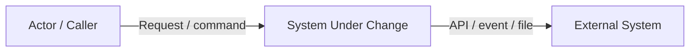
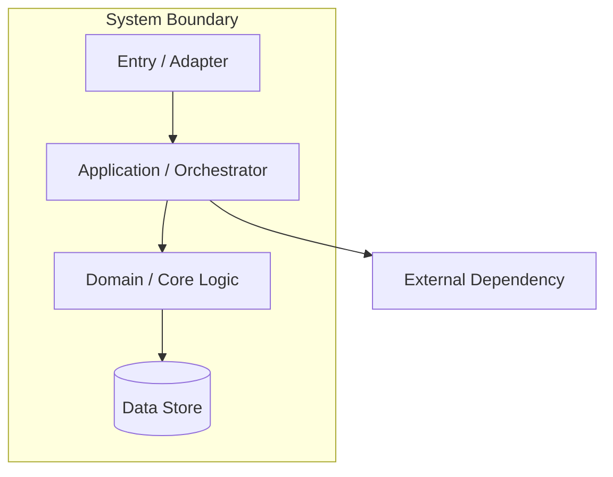
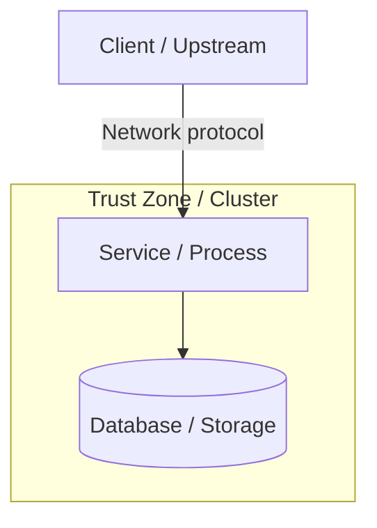

## Scope and Inputs

<!-- Summarize the change boundary and list proposal/specs/code/config/deployment sources examined. -->

- **Change boundary:**
- **Existing constraints:**
- **Assumptions:**
- **Out of scope:**

## Current-State Summary

<!-- Explain only the existing structure needed to understand this change. -->

## System Context

### Context Participants

| Participant | Type | Responsibility | Owner | Trust boundary |
|---|---|---|---|---|
|  |  |  |  |  |

## Target Component Architecture

### Component Responsibilities

| Component | Responsibility | Inputs | Outputs | State owned | Failure boundary |
|---|---|---|---|---|---|
|  |  |  |  |  |  |

## Interfaces and Dependencies

| From | To | Interface/protocol | Sync/async | Contract/version | Timeout/SLA | Compatibility |
|---|---|---|---|---|---|---|
|  |  |  |  |  |  |  |

## Deployment Topology

<!-- Keep this section when deployment/process/network placement matters; otherwise state “Not applicable” and why. -->

| Runtime unit | Environment/node | Scaling model | Configuration/secrets | Health/readiness | Owner |
|---|---|---|---|---|---|
|  |  |  |  |  |  |

## Security and Trust Boundaries

- **Authentication:**
- **Authorization:**
- **Secrets:**
- **Network boundaries:**
- **Sensitive operations/data:**
- **Audit requirements:**

## Capability-to-Component Mapping

| Capability / requirement | Entry component | Owning component | Supporting components | Notes |
|---|---|---|---|---|
|  |  |  |  |  |

## Architectural Constraints and Invariants

- 

## Alternatives and Open Decisions

| Question/decision | Options | Current preference | Evidence needed | Owner/status |
|---|---|---|---|---|
|  |  |  |  |  |
