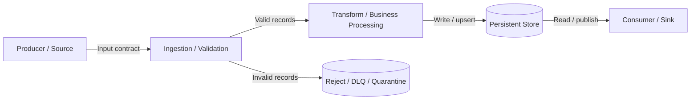
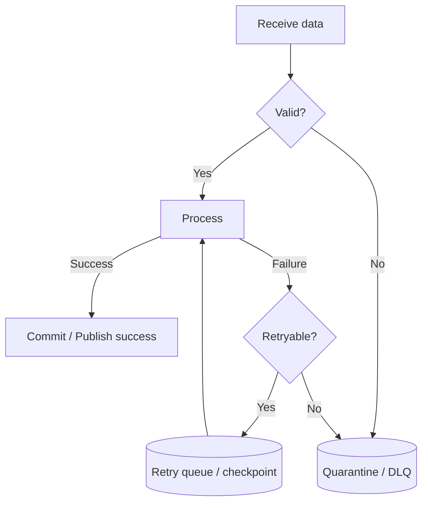

## Scope and Data Inventory

| Data object | Producer | Consumers | Classification | Source of truth | Retention |
|---|---|---|---|---|---|
|  |  |  |  |  |  |

## End-to-End Data Flow

### Flow Steps

| Step | From → To | Data/contract | Transformation | Validation | Persistence | Failure destination |
|---|---|---|---|---|---|---|
| 1 |  |  |  |  |  |  |

## Data Contracts

### <data object or interface>

| Field | Type | Required | Meaning | Constraints | Sensitive | Compatibility rule |
|---|---|---|---|---|---|---|
|  |  |  |  |  |  |  |

- **Contract/version identifier:**
- **Primary/business key:**
- **Idempotency/deduplication key:**
- **Partitioning/bucketing:**
- **Ordering guarantees:**
- **Null/default semantics:**
- **Schema evolution policy:**

## Transformations and Business Rules

| Transformation | Input | Output | Rule/algorithm | Deterministic | Error handling |
|---|---|---|---|---|---|
|  |  |  |  |  |  |

## Storage and Lifecycle

| Store | Purpose | Write pattern | Read pattern | Consistency | Retention/deletion | Backup/recovery |
|---|---|---|---|---|---|---|
|  |  |  |  |  |  |  |

## Data Quality Controls

| Control | Stage | Rule/threshold | Blocking? | Metric/evidence | Remediation |
|---|---|---|---|---|---|
|  |  |  |  |  |  |

## Failure, Replay, and Recovery Flow

- **Replay boundary:**
- **Checkpoint/offset semantics:**
- **Duplicate handling:**
- **Partial-write handling:**
- **Recovery objective:**

## Security, Privacy, and Governance

- **Classification and sensitive fields:**
- **Encryption in transit/at rest:**
- **Masking/tokenization:**
- **Access control:**
- **Retention/deletion/legal hold:**
- **Audit and lineage:**

## Capacity and Freshness

| Measure | Current | Expected | Peak | Limit/SLO | Scaling response |
|---|---|---|---|---|---|
| Volume |  |  |  |  |  |
| Throughput |  |  |  |  |  |
| Payload size |  |  |  |  |  |
| Freshness/latency |  |  |  |  |  |

## Requirement-to-Data-Flow Mapping

| Requirement/scenario | Flow steps | Data objects | Quality/security controls | Evidence |
|---|---|---|---|---|
|  |  |  |  |  |
