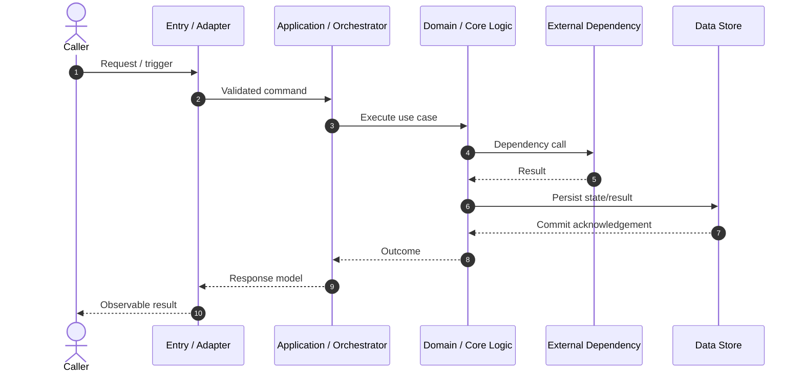
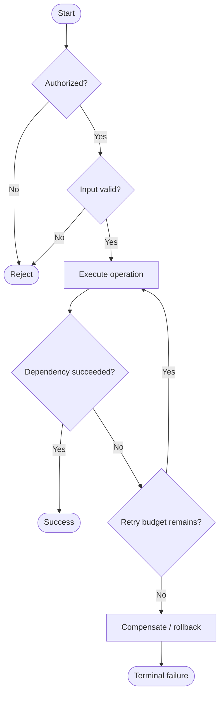
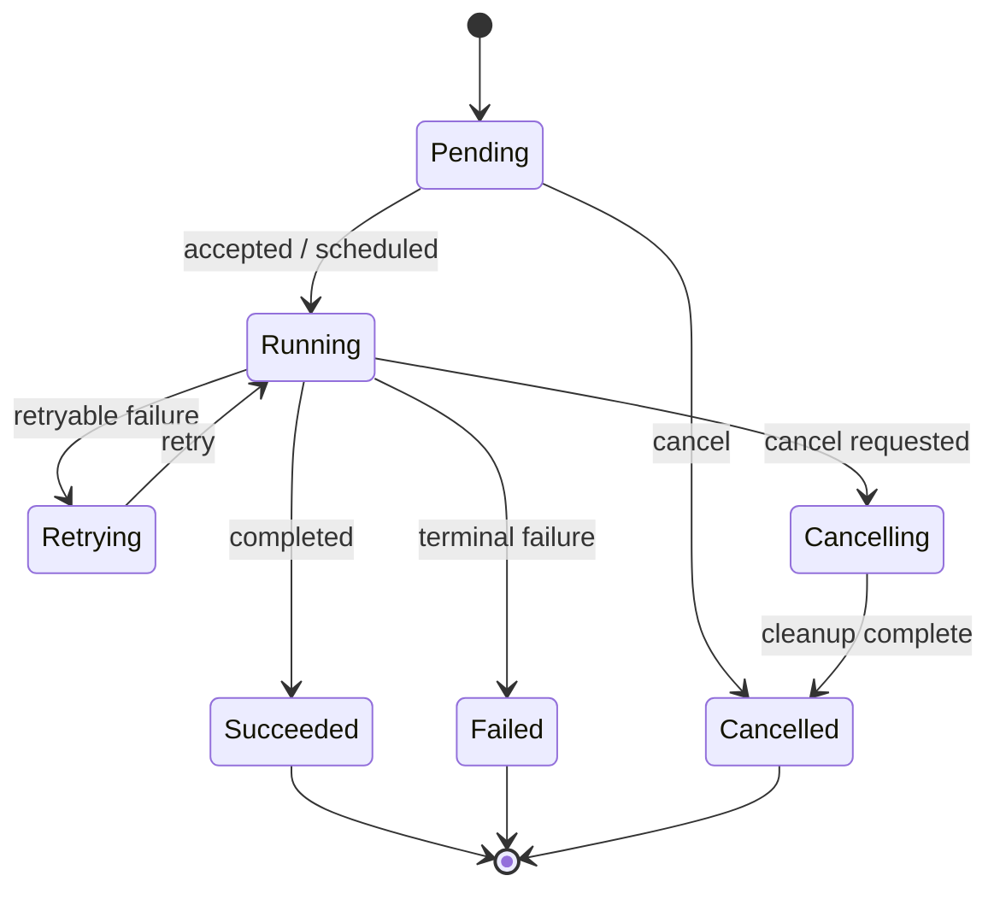

## Runtime Scope

- **Actors/triggers:**
- **Entry points:**
- **Preconditions:**
- **Runtime invariants:**
- **Excluded flows:**

## Primary Interaction Sequence

### Sequence Notes

| Step | Preconditions | Action | Timeout | Retry/idempotency | Observable result |
|---|---|---|---|---|---|
|  |  |  |  |  |  |

## Control Flow and Branches

### Branch Conditions

| Branch/decision | Condition | Source of truth | Result/action | Spec scenario |
|---|---|---|---|---|
|  |  |  |  |  |

## Lifecycle State Machine

<!-- Keep when an entity/job/request has meaningful lifecycle states; otherwise state why it is not applicable. -->

| State | Entry condition | Allowed transitions | Persistent fields | Timeout | Terminal? |
|---|---|---|---|---|---|
|  |  |  |  |  |  |

## Failure and Recovery Paths

| Failure point | Detection | Retry policy | Fallback/compensation | User/operator signal | Terminal condition |
|---|---|---|---|---|---|
|  |  |  |  |  |  |

## Concurrency and Idempotency

- **Concurrency model:**
- **Locking/serialization:**
- **Idempotency key and scope:**
- **Duplicate request behavior:**
- **Race conditions and prevention:**
- **Backpressure/rate limiting:**

## Timeouts, Retries, and Circuit Breaking

| Call/operation | Timeout | Attempts | Backoff/jitter | Retryable errors | Circuit/fallback |
|---|---|---|---|---|---|
|  |  |  |  |  |  |

## Cancellation, Compensation, and Manual Intervention

- **Cancellation points:**
- **Cleanup behavior:**
- **Compensation order:**
- **Irreversible side effects:**
- **Manual runbook/intervention:**

## Observability of Runtime Flow

| Signal | Name/fields | Emission point | Correlation key | Alert/SLO |
|---|---|---|---|---|
| Log |  |  |  |  |
| Metric |  |  |  |  |
| Trace |  |  |  |  |
| Audit event |  |  |  |  |

## Scenario-to-Flow Mapping

| Spec scenario | Sequence steps | Branch/state path | Test level | Evidence |
|---|---|---|---|---|
|  |  |  |  |  |
